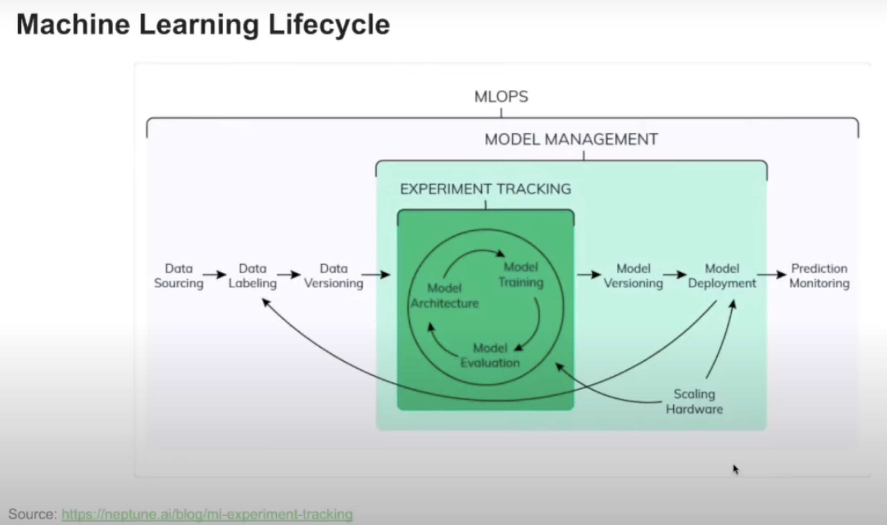

# Model Management 

Check out the [neptune.ai Blog](ttps://neptune.ai/blog) for a lot of content on MLOps.

Experiment Tracking is a part of the Machine Learning Lifecycle:

Manul model management has a number of disadvantages:
- The process is **error prone**: you can accidentally overwrite an existing model in a folder
- **No model versioning** or it is hard to keep track of the model versions once we start growing the number of ML models
- **No model lineage**, therefore it is hard to understand the evolution of the models (their hyperparameters, trainng and validation datasets used, etc.)

# Logging models in MLflow

Two options:
1. Log model as an artifact:
  
        mlflow.log_artifact(local_path, artifact_path="models")

This method might not be as useful as MLflow does not store any information about the model this way.

2. Log model using the method `log_model`

        mlflow.<framework>.log_model(model, artifact_path="models")

Preferred method as a lot of useful information about the model is saved.

A logged model can later be easily deployed.

